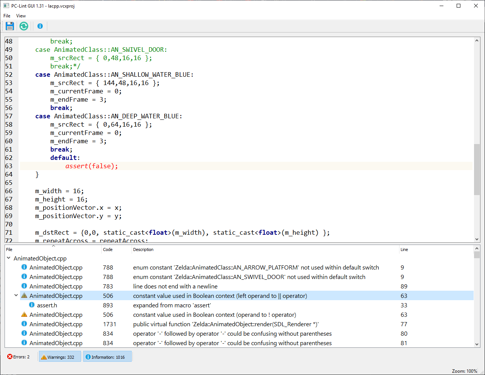

# **PC-Lint GUI**

## About

A Qt based GUI application written in C++ to use with the C/C++ static analysis tool PC-Lint or PC-Lint Plus

## Features

* 32/64-bit release
* Currently supports PC-Lint Plus versions only (see below)
* Basic code editor with limited syntax highlighting
* Tree view of lint output to navigate through
* Message type filtering to filter out errors, warnings and informational messages

As this project is in early development, there are quite a few bugs to be expected.
Newer features to be implemented soon in no particular order

* Code editor complete syntax highlighting
* Edit lint (.lnt) file; surpress/show lint messages etc
* Lint message help on code numbers
* Multithread support for old PC-Lint versions

## Building

PC-Lint GUI is built using `Qt 5.14.1` and `C++17` using `MinGW (g++ 7.3.0)`
Build the project `PC-Lint GUI.pro` in the folder `PC-Lint GUI` 

## Tests

Build the project `PC-Lint-GUI-Test.pro` in the folder `PC-Lint GUI Test`

## Bugs

See `bugs.txt` for the list of current bugs/features

## Release history

N/A 